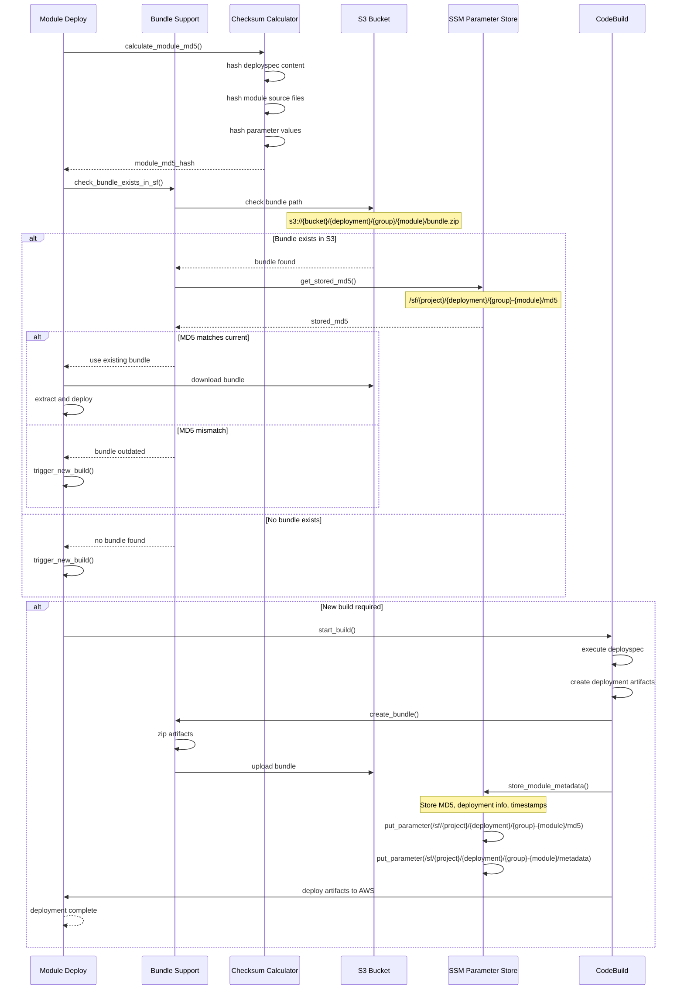

# Bundle Management Workflow

This sequence diagram shows how Seed-Farmer manages module bundles for optimization and caching.

## Bundle Lifecycle

1. **MD5 Calculation**: Hash of deployspec + source + parameters
2. **Bundle Check**: Verify if bundle exists and is current
3. **Cache Hit**: Use existing bundle if MD5 matches
4. **Cache Miss**: Build new bundle and update metadata
5. **Storage**: Upload bundle to S3 and metadata to SSM
