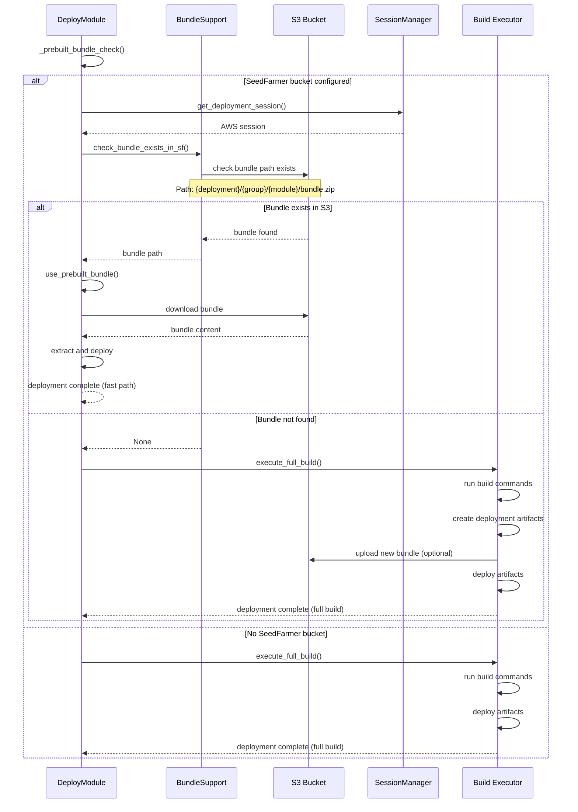

# Bundle Optimization Flow

This diagram shows how Seed-Farmer optimizes deployments using prebuilt bundles stored in S3.



## Bundle Strategy Benefits

1. **Performance**: Avoids rebuilding unchanged modules
2. **Consistency**: Ensures same artifacts across environments  
3. **Efficiency**: Reduces CodeBuild usage and costs
4. **Reliability**: Pre-validated bundles reduce deployment failures

## Bundle Path Structure
```
s3://{seedfarmer-bucket}/{deployment}/{group}/{module}/bundle.zip
```

The bundle contains:
- Built artifacts (compiled code, dependencies)
- CloudFormation/CDK templates
- Deployment metadata
- Module-specific assets
