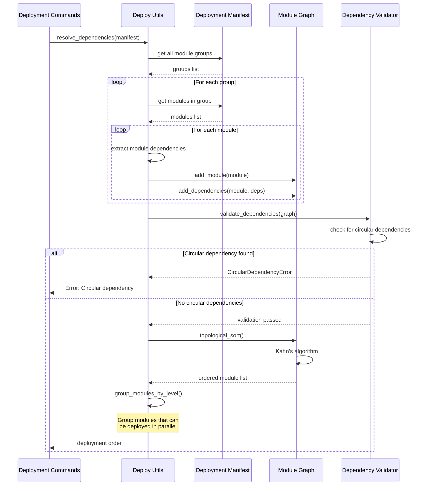

# Dependency Resolution Workflow

This sequence diagram shows how Seed-Farmer resolves and orders module dependencies for deployment.



## Dependency Types

### Explicit Dependencies
- `dependsOn` field in module manifest
- Direct module-to-module relationships

### Implicit Dependencies  
- Parameter references (`${module.output}`)
- Data file references from other modules
- Cross-module resource dependencies

### Deployment Levels
```
Level 0: [ModuleA, ModuleB]     # No dependencies - parallel
Level 1: [ModuleC]              # Depends on A,B - sequential  
Level 2: [ModuleD, ModuleE]     # Depends on C - parallel
```

## Error Handling
- **Circular Dependencies**: Detected and reported before deployment
- **Missing Dependencies**: Validated during graph construction
- **Invalid References**: Caught during parameter resolution
