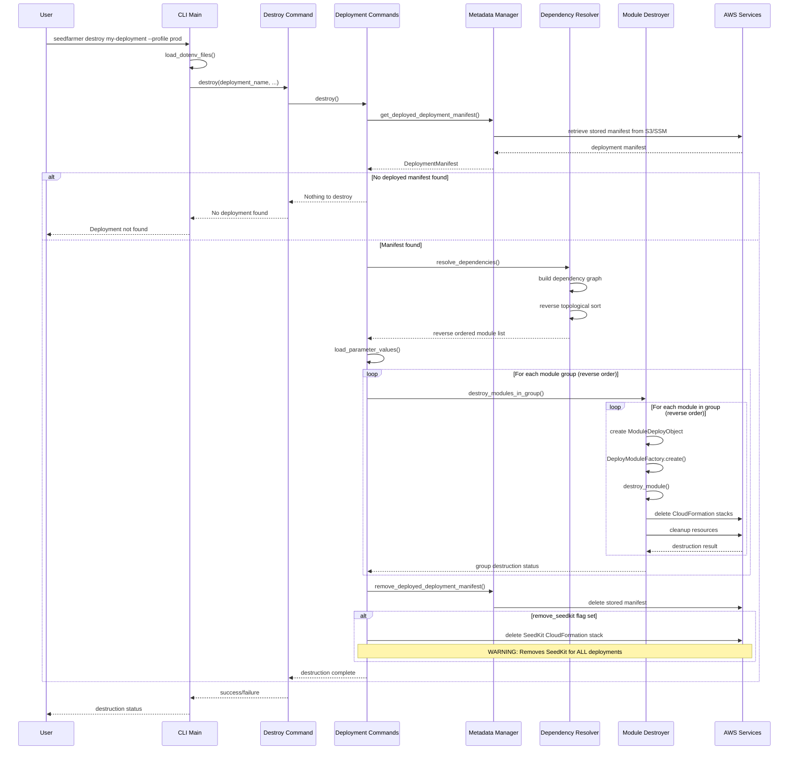

# Destroy Deployment Workflow

This sequence diagram shows the process when running `seedfarmer destroy deployment-name`.

## Key Differences from Apply

1. **Reverse Order**: Modules destroyed in reverse dependency order
2. **Stored Manifest**: Uses previously deployed manifest, not source manifest
3. **Resource Cleanup**: Explicitly deletes CloudFormation stacks and resources
4. **Metadata Cleanup**: Removes deployment tracking metadata
5. **Optional SeedKit Removal**: Can remove shared SeedKit infrastructure
