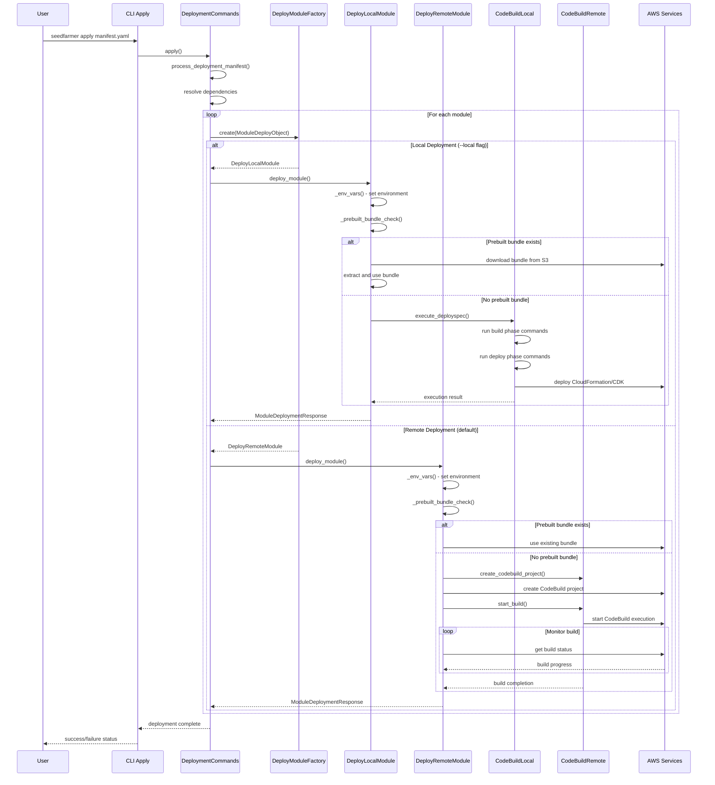

# Sequence Diagrams

## Local vs Remote Deployment Flow

This diagram shows the detailed execution flow for both local and remote deployment strategies.

### Key Differences

#### Local Deployment
- Executes deployspec commands directly on local machine
- Uses local AWS credentials/session
- Faster for development and testing
- Limited by local environment capabilities

#### Remote Deployment  
- Creates isolated CodeBuild projects
- Uses SeedFarmer toolchain roles
- Better for production deployments
- Provides build isolation and consistent environment
- Supports complex build requirements and custom images
